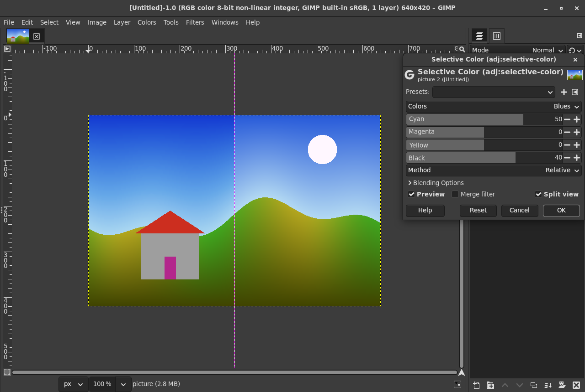
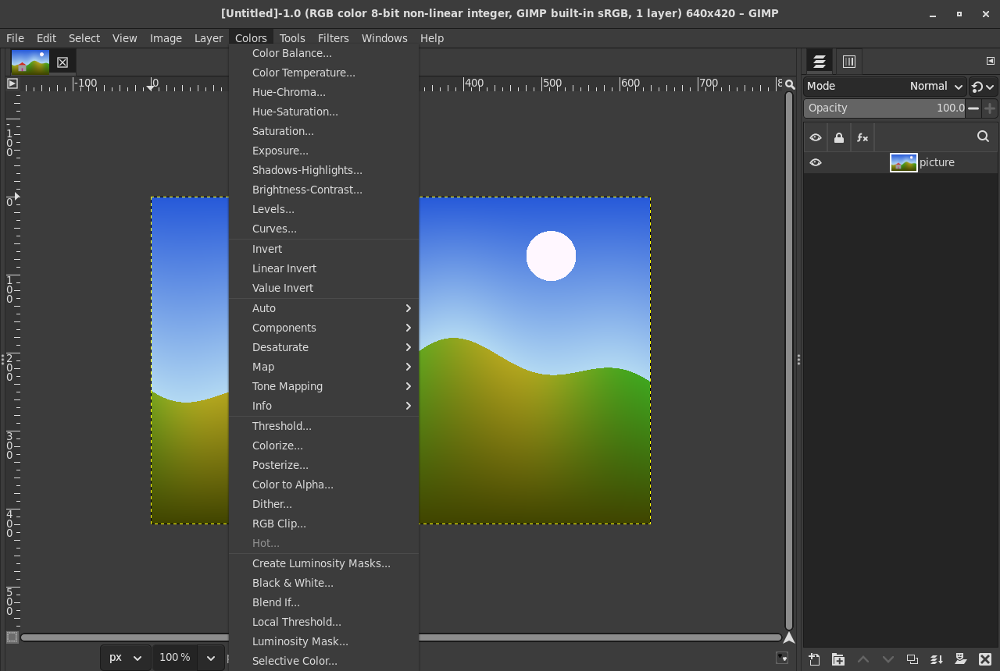
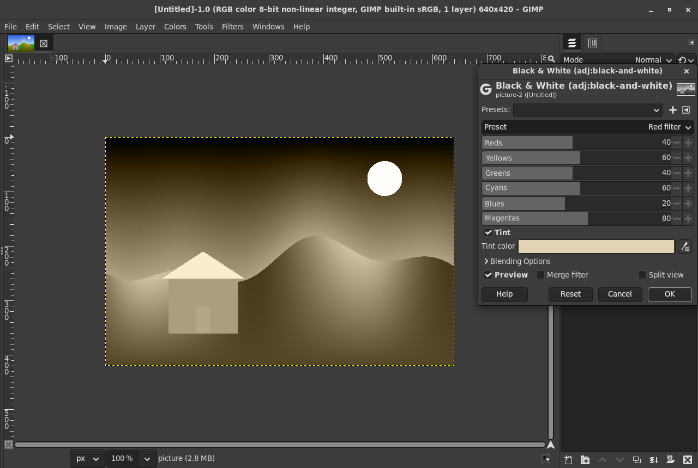
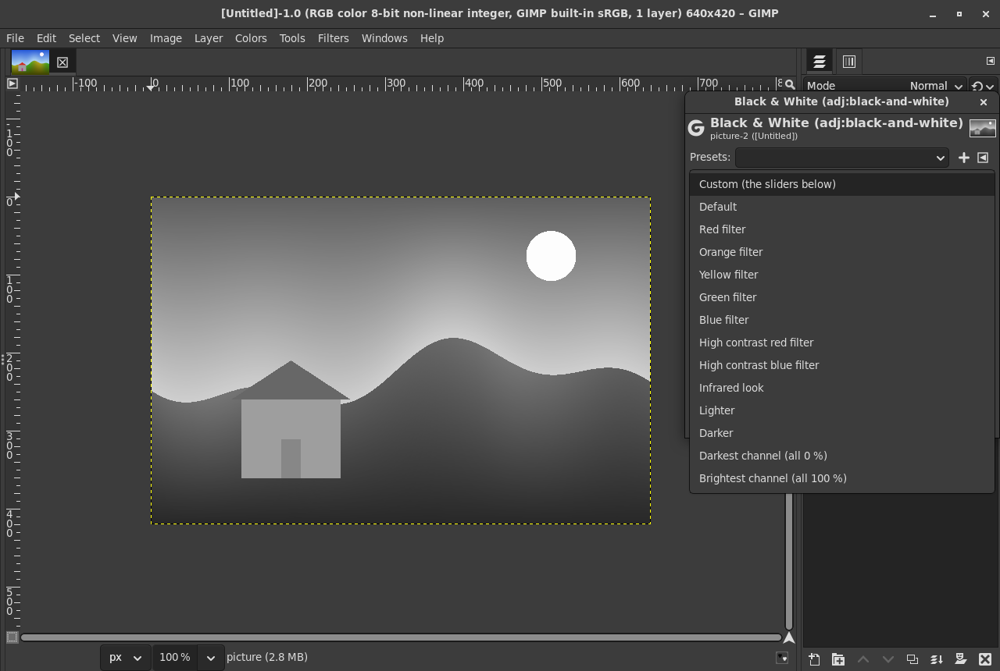
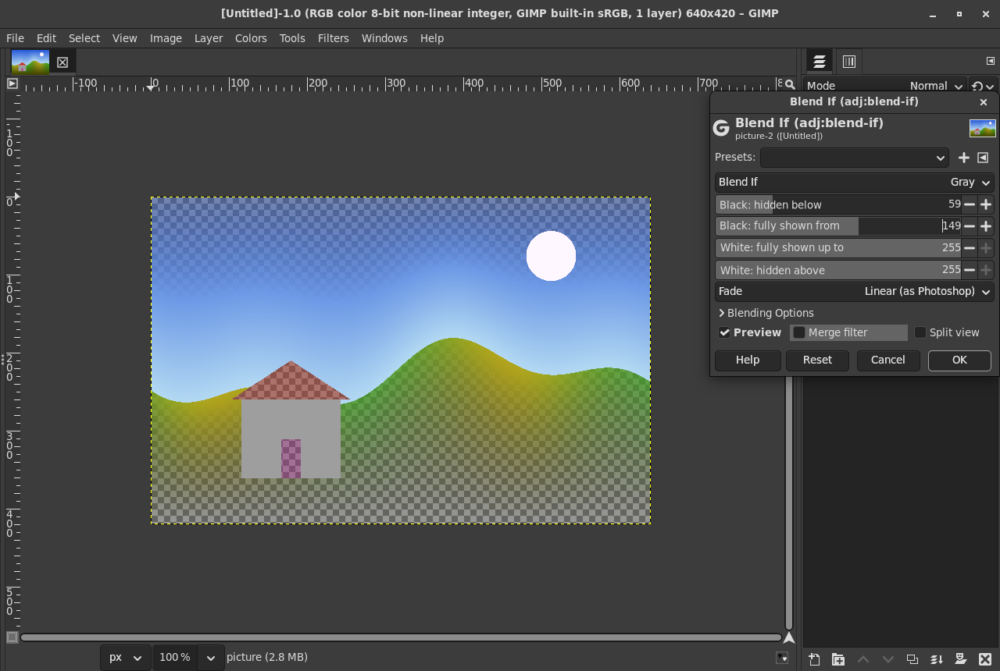
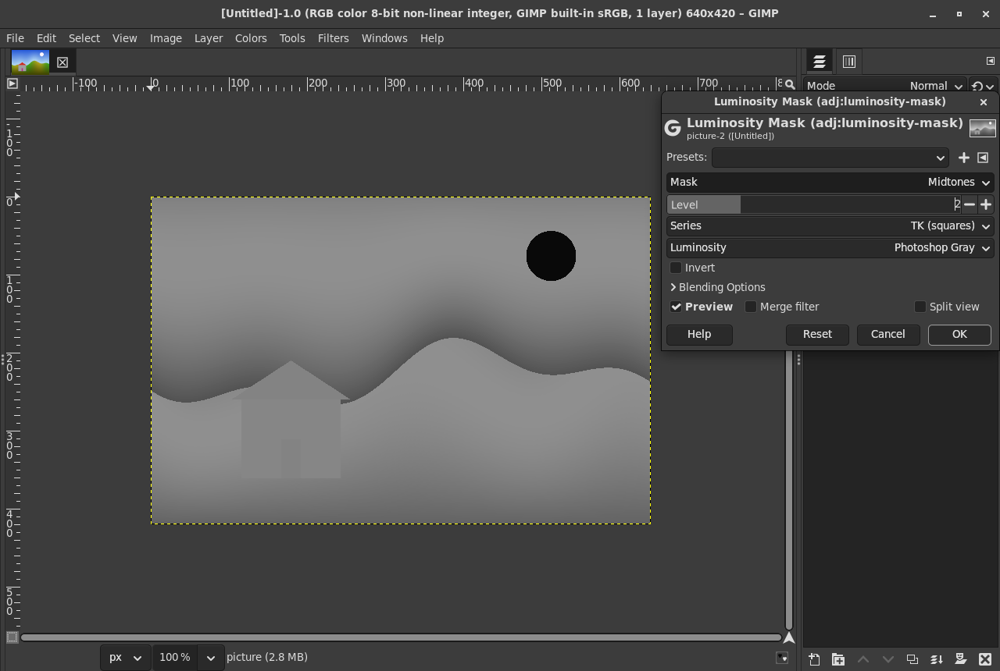
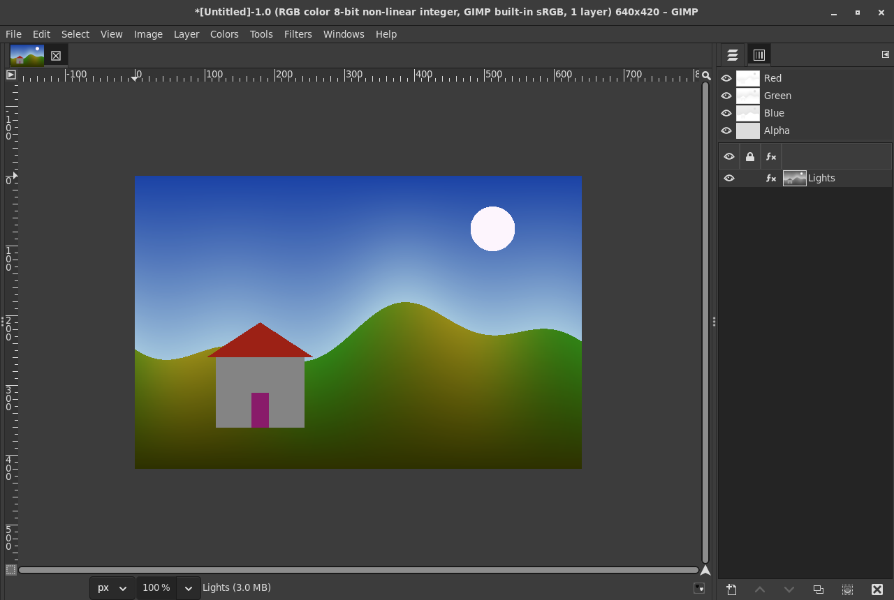
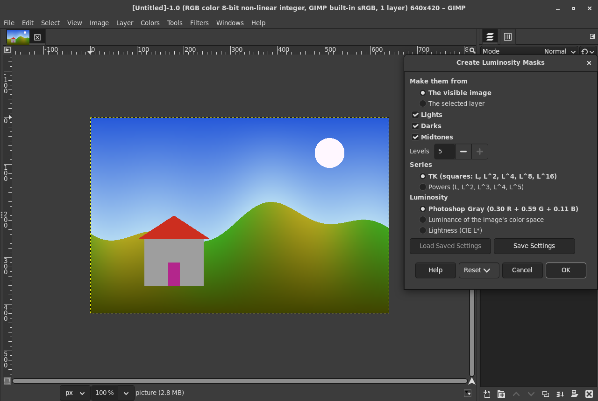
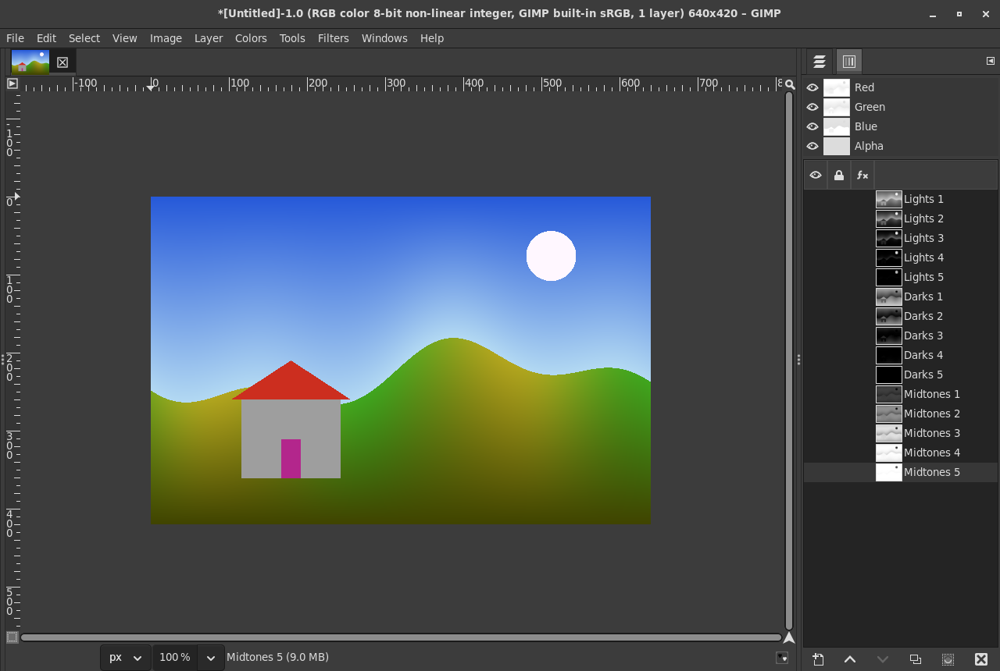

# gegl-adjustments

Four of Photoshop's adjustments as GEGL operations for GIMP 3, each a
non-destructive filter under Colors (live preview, split view, editable
later in the layer's effects, kept in XCF files), named in Photoshop's
words so that people find them:

- **Selective Color** (`adj:selective-color`): cyan, magenta, yellow and
  black in reds, yellows, greens, cyans, blues, magentas, whites, neutrals
  and blacks, Relative or Absolute, with the formulas reverse engineered
  from Photoshop.
- **Black & White** (`adj:black-and-white`): gray with a weight for each
  of six hues, Photoshop's defaults, presets, and a tint.
- **Blend If** (`adj:blend-if`): the "This Layer" half of Photoshop's
  Blending Options: pixels become transparent by their own gray, red,
  green or blue value, with split sliders for soft edges.
- **Luminosity Mask** (`adj:luminosity-mask`): Lights 1 to 5, Darks 1 to
  5, Midtones 1 to 5 as in Tony Kuyper's luminosity masks, tonal (zone),
  saturation and hue ranges with a feather; as a gray image, as the
  layer's transparency, or live on a channel.

And a small plug-in, **Colors > Create Luminosity Masks**, that makes the
standard set of mask channels.

It is LGPL-3.0-or-later, like GEGL, so that the operations can be offered
upstream to GEGL together (as `gegl:selective-color` and so on).

## Why

GIMP issue [#15505](https://gitlab.gnome.org/GNOME/gimp/-/work_items/15505)
(importing PSD adjustment layers as GEGL filters) says of Selective Color
"Not sure what the equivalent GEGL filter(s) would be", and draft MR
[!2598](https://gitlab.gnome.org/GNOME/gimp/-/merge_requests/2598) maps
Black & White to "similar GEGL operations" only. See
gimp-plugin-devtools/docs/photoshop-gaps.md for the wider survey.

None of the four exists in GEGL or GIMP 3.2.6. Checked on 2026-09-27:

- GEGL master (commit 2d6f9f5, 2026-09-26), `operations/` including the
  workshop: no selective colour, hue-weighted black and white, blend-if or
  luminosity mask operation. The nearest are `gegl:mono-mixer` (RGB
  weights), `gegl:saturation`, `gegl:hue-chroma` and the unbuilt workshop
  `selective-hue-saturation` (a hue range with hue, saturation and
  lightness, not CMYK inks).
- The Flatpak GIMP 3.2.6, `gegl --list-all`: 259 operations ship with it.
  A listing that also reads the operations installed in
  `~/.var/app/org.gimp.GIMP/data/gegl-0.4/plug-ins` (on the machine of
  this work mostly LinuxBeaver's; the survey counted 472, it is 473 now)
  has none of the four either (by their properties: the nearest,
  `lb:threshold-alpha` and `lb:mask-hack`, have no split sliders, hue
  weights, inks or tonal series).
  GIMP's own `gimp:` operations (listed in `app/actions/filters-actions.c`)
  do not do them.
- GIMP 3.2's PSD import (`plug-ins/file-psd`) knows the `selc` and `blwh`
  adjustment layer keys but does not convert them, and skips the layer
  blending ranges that Blend If is stored in (`psd-load.c`, "FIXME").

## Using them in GIMP

All four are in the Colors menu:

They work on any image precision (8, 16 and 32 bit integer, half, float,
double, linear or perceptual) and on grayscale images, and leave alpha as
it is (except Blend If and the transparency output of the masks, whose
job is alpha).

### Selective Color

**Colors** chooses which family's four sliders the dialog shows, as in
Photoshop; every family's settings apply at once. **Cyan**, **Magenta**,
**Yellow** and **Black** go from -100 to +100 %. **Method**: Relative
(Photoshop's default) changes an ink in proportion to how much of it a
color has (pure red has no cyan, so adding cyan leaves it as it is);
Absolute adds the same amount to every color of the family.

The formulas are those Clément Bœsch reverse engineered from Photoshop
and published in
["Understanding selective coloring in Adobe Photoshop"](http://blog.pkh.me/p/22-understanding-selective-coloring-in-adobe-photoshop.html)
(2017), implemented in FFmpeg's `libavfilter/vf_selectivecolor.c`
(LGPL-2.1+). Graphite's `selective_color` node (Apache-2.0) was read too.
The code here is written for this operation, in floating point. For a
pixel with channels in 0 to 1 and max, mid and min its largest, middle
and smallest channel, each family has a weight:

| Family | The pixel is in it when | Weight |
|---|---|---|
| Reds, Greens, Blues | red, green or blue is the largest | max - mid |
| Cyans, Magentas, Yellows | red, green or blue is the smallest | mid - min |
| Whites | min > 1/2 | 2 min - 1 |
| Blacks | max < 1/2 | 1 - 2 max |
| Neutrals | always | 1 - abs(max - 1/2) - abs(min - 1/2) |

Cyan acts on red, magenta on green, yellow on blue. With a family's ink
slider a and black slider k (as fractions), a channel v changes by
weight x clamp(((-1 - a) k - a) m, -v, 1 - v), with m = 1 for Absolute and
m = 1 - v for Relative; the changes of all families add up. The weights of
one pixel add up to at most 1 (its two hue families, Neutrals, and Whites
or Blacks), so the result stays within 0 to 1 (checked).

Matches: Bœsch's own Photoshop measurements (the pixel 180, 100, 50 with
Reds: every value in his post, in tests/check.c), the formulas in double
precision (3e-7), and FFmpeg's `selectivecolor` filter (tests/crosscheck.sh:
identical with one family at 8 bits; at most 2 codes with all nine,
because FFmpeg rounds each family's change before it adds them). It is
not compared with Photoshop itself here.

### Black & White

**Reds**, **Yellows**, **Greens**, **Cyans**, **Blues** and **Magentas**
go from -200 to +300 %, with Photoshop's defaults 40, 60, 40, 60, 20 and
80 (the same in psd-tools, Graphite and tutorials showing Photoshop's
dialog). The gray is the formula Mark Ransom published on Stack Overflow
([answer 55233732](https://stackoverflow.com/a/55233732), 2019), which he
reports gives Photoshop's values for the question's sample and which
Graphite's `black_and_white` node (Apache-2.0, aiming at PSD
compatibility) uses too:

- the smallest channel is gray and stays;
- what lies above it is a secondary color (the part two channels share)
  and a primary (the rest of the largest channel);
- for a pixel whose smallest channel is blue, with r' = r - min and
  g' = g - min: gray = min + Yellows x min(r', g') + Reds x (r' - min(r', g'))
  + Greens x (g' - min(r', g')); likewise with Cyans and Magentas.

So each slider acts only on colors of its own hue, grays stay gray
whatever the sliders, all sliders at 100 % give the largest channel and
at 0 % the smallest (all checked). The result is limited to 0 to 1 as in
Photoshop (or to the pixel's own channels if they lie beyond, in float
images). An earlier, different formula circulates too (Ivan Kuckir and
Royi on dsp.stackexchange question 688: the HSL lightness scaled by
hue-interpolated weights, which Royi reports within 1 of 255 of
Photoshop on his test image). The two agree on pure primaries and
secondaries and on grays, but not on less saturated colors: (204, 102, 51)
gives 122 with Ransom's and 119 with the other. Neither is verified
against Photoshop here (it is not available). Ransom's is used, as
Graphite does for its PSD compatibility; Graphite's tint test values
(below) agree with it and not with the other.

**Tint** gives the gray image the tint color's hue and saturation the way
the Luminosity blend mode does (SetLum and ClipColor of the
[W3C Compositing and Blending](https://www.w3.org/TR/compositing-1/#blendingnonseparable)
specification, luminosity 0.3 R + 0.59 G + 0.11 B). The default tint color
#e1d3b3 (hue 42, saturation 20 % in HSB) is Graphite's default, which it
gives as Photoshop's; that is not verified here. Current
Photoshop picks the tint with a color swatch and the PSD file stores it as
a color (`tintColor` in `blwh`); older versions showed Hue and Saturation
sliders. So the tint is a color here, which GIMP's color dialog sets by
hue and saturation too. The tinted results match Graphite's test values
(within 0.4 of 255).

**Preset**: Custom uses the sliders (the default). Default is
Photoshop's default mix. The others are **this filter's own mixes**,
named after the color filters used with black and white film (Red,
Orange, Yellow, Green and Blue filter, High contrast red and blue,
Infrared look, Lighter, Darker) plus Darkest channel (all 0 %) and
Brightest channel (all 100 %). Photoshop's own preset values are not
published by Adobe, and the values found online disagree with each other,
so they are not copied. A preset other than Custom is used instead of the
sliders (GIMP's generated dialog cannot move the sliders to the preset's
values; they are greyed out). GIMP's own Presets menu at the top of the
dialog saves and loads slider settings.

### Blend If

**Blend If** chooses whose sliders the dialog shows: Gray, Red, Green or
Blue; all four apply, and their factors multiply the pixel's alpha. Each
has four values on Photoshop's scale of 0 to 255, in the order of the PSD
file's layer blending ranges: **Black: hidden below** and **Black: fully
shown from** (the two halves of the black slider, split with Alt in
Photoshop), **White: fully shown up to** and **White: hidden above**.
Between the halves pixels fade, linearly (as Photoshop, the default) or
along a smooth curve (**Fade: Smooth**). An unsplit slider hides the
values beyond it and keeps its own value, as Adobe's help describes it
("if you drag the white slider to 235, pixels with brightness values
higher than 235 ... will be excluded"). Gray is 0.3 R + 0.59 G + 0.11 B,
the luminosity Photoshop documents for its histogram; that Blend If uses
the same, and its exact rounding at 8 bits, are not verified against
Photoshop.

The colors are left as they are, so the filter stays non-destructive; on
a layer without an alpha channel the hidden pixels show what lies below
while the filter is live, and GIMP adds an alpha channel when you merge
it from the dialog (the operation has GIMP's `needs-alpha` key).

**Not included: the "Underlying Layer" sliders.** They need the image
below the layer, which a filter does not see: GIMP 3.2 gives a filter only
its own drawable, and makes filters with a second (aux) input destructive
([#11904](https://gitlab.gnome.org/GNOME/gimp/-/work_items/11904)). What
works today: put the layer and a copy of what lies below in a layer group,
or use a luminosity mask of the lower layer (below) as the upper layer's
mask.

### Luminosity Mask

**Mask**: Lights, Darks, Midtones (each with a **Level** of 1 to 5), a
tonal range (zone), a saturation range or a hue range. With L the
luminosity of a pixel (0 to 1):

| Mask | TK series (default) | Powers series |
|---|---|---|
| Lights 1 | L | L |
| Lights n | Lights (n-1) squared: L^2, L^4, L^8, L^16 | L^n |
| Darks n | the same of 1 - L | (1 - L)^n |
| Midtones n | (1 - Lights n)(1 - Darks n) | (1 - L^n)(1 - (1 - L)^n) |

The TK series is Tony Kuyper's recipe:

- His original tutorial (2006,
  [goodlight.us, "Different Masks for Different Tones"](https://goodlight.us/writing/luminositymasks/luminositymasks-5.html)):
  "Light Lights" is "Lights" intersected with itself, "Bright Lights" is
  "Light Lights" intersected with itself, and so on; the Darks are the
  inverted Lights, narrowed the same way; the Midtones are the whole image
  with a Lights and a Darks mask subtracted.
- His 16-bit version
  ([Good Light Journal, "How to Make 16-bit Luminosity Masks"](https://tonykuyper.wordpress.com/2015/02/28/how-to-make-16-bit-luminosity-masks/),
  2015) with Photoshop's Calculations: Lights-1 is the Gray channel;
  Lights-2 is Lights-1 multiplied with Lights-1 (the screenshot shows
  both sources Lights-1, Blending Multiply), each next mask the previous
  one multiplied the same way; Midtones-1 is Lights-1 and Darks-1, both
  inverted, multiplied.

So Lights 2 is L x L and Midtones 1 is L (1 - L). The Powers series (each
level intersected once more with Lights 1, L^n) is the other definition
in use, as for example
[Todd Marsh describes it](https://toddmarsh.com/luminosity-masks-photoshop-tonal-selection/).

**From**, **To** and **Feather** give a tonal range on Photoshop's 0 to
255 scale (zone masks), a saturation range (HSV saturation, 0 to 100 %),
or a hue range (**Hue**, **Width**, **Feather** in degrees, around the
circle); the feather fades smoothly or linearly. A hue mask is weighted by
the saturation, so that grays (whose hue means nothing) are not selected.
**Luminosity**: Photoshop Gray (0.3 R + 0.59 G + 0.11 B of the display
values, what Photoshop's Gray channel and the panels start from), the
luminance of the image's color space with its curve, or CIE L*.
**Invert**, and **Output**: a gray mask, or the image with the mask as
its transparency.

#### Live masks on channels

GIMP 3.2 keeps filters live on channels, and this operation takes a
channel's values as they are (a channel is a grayscale drawable without
alpha, in GIMP's own mask format), so a luminosity mask can stay editable:

1. Make a channel with the image's gray: for example Colors > Luminosity
   Mask on a copy of the image layer with Mask Lights, Level 1, OK, then
   Edit > Copy Visible and paste into a new channel; or Create Luminosity
   Masks (below) and use its Lights 1.
2. Select the channel in the Channels dock, open Colors > Luminosity
   Mask, choose the mask and level, OK. The channel shows the filter
   (fx); it is kept in the XCF (checked: tests/gui/shots.sh loads the
   saved XCF and finds the live filter on the channel), and you change it
   later from the fx menu.
3. Channel > Channel to Selection, or a layer mask initialized from the
   channel.

GIMP 3.2 does not keep filters live on layer masks.

#### Create Luminosity Masks

Colors > Create Luminosity Masks makes Lights, Darks and Midtones 1 to 5
(or fewer) as channels from the visible image or the selected layer, with
the TK or the Powers series and the luminosity of your choice, computed
with the operation (15 channels of a 6000 x 4000 image in 4 seconds).

The channels hold the masks' values rather than live filters: GIMP 3.2's
PDB refuses non-destructive filters on channels to plug-ins ("only
drawables of type GimpLayer can have non-destructive effects",
`gimp-drawable-append-filter`), although its menu can do it (above). A
live one is made by hand from a channel as described above.

## Color spaces

Photoshop works on the document's display values, in the document's
color space. So do these operations: they process R'G'B' in the image's
own space (babl converts to it and back), the values with the image's
curve.

- An sRGB image (the usual case, 8 bit or 16 bit perceptual) gets exactly
  the formulas above.
- An image with GIMP's linear precision is converted to the sRGB curve
  for the operation and back, so the result is the same as for the
  perceptual image (checked).
- An image in another space (Adobe RGB, Rec. 2020, ProPhoto) is worked on
  in that space's own numbers, as Photoshop does with a document in that
  space (checked for Adobe RGB). A given setting then looks different
  than on an sRGB image, as in Photoshop.
- A profile with a linear curve (a "linear Rec. 2020" profile) makes the
  image's own values linear, and these are what the operations see.

Values outside 0 to 1 (float images): Selective Color classifies and
limits with the values clamped to 0 to 1 and adds its changes to the
original value; Black & White limits its gray to 0 to 1 or to the pixel's
own range; the masks clamp the luminosity. NaN counts as 0 (Blend If
leaves NaN colors as they are); the results are always finite except
that Selective Color keeps an infinite channel infinite.

## Building and installing

Needs meson, ninja, a C compiler and the GEGL development files (0.4.62 or
newer).

    meson setup build -Dmoduledir=$HOME/.local/share/gegl-0.4/plug-ins \
      -Dplugindir=$HOME/.config/GIMP/3.2/plug-ins
    ninja -C build install

For the Flatpak version of GIMP, build inside it with
[gimp-plugin-devtools](https://github.com/sandbranch/gimp-plugin-devtools),
which installs the operations into
`~/.var/app/org.gimp.GIMP/data/gegl-0.4/plug-ins` and the plug-in into
GIMP's plug-in folder:

    gimp-build.sh . meson setup build -Dmoduledir=\$GEGL_OPDIR -Dplugindir=\$GIMP_PLUGINDIR
    gimp-build.sh . ninja -C build install

Restart GIMP after installing. Without `-Dplugindir` the plug-in is not
installed. On the command line:

    gegl photo.jpg -o graded.jpg -- adj:selective-color reds-cyan=-30 reds-black=10 method=absolute
    gegl photo.jpg -o bw.jpg -- adj:black-and-white preset=yellow-filter tint=true

## Tests

None needs the network or a display. Every one runs isolated from your
own folders with tests/isolate.sh (a copy of gimp-plugin-devtools'
isolate.sh: HOME and the XDG folders in a throwaway tests/output/home,
also for flatpak run itself, and no GVFS), and compares listings of your
GIMP, Blender, Godot, Krita and Tiled folders before and after
(gimp-plugin-devtools/snapshot.sh): each suite fails if anything there
changed.

- `tests/check.sh`: 130 checks (tests/check.c), built and run twice in the
  Flatpak SDK, as usual and with AddressSanitizer and UBSan (with leak
  checks of this code). Selective Color against a reference of the
  published formulas for every family alone and all at once, both
  methods; Bœsch's Photoshop values; each family changes only its own
  colors; results within 0 to 1. Black & White against its reference,
  Photoshop's defaults on primaries and secondaries, grays stay gray with
  every preset, each slider acts only on its own hues, the tint against
  Graphite's values and keeping the luminosity. Blend If: exact alpha at
  and between the split points for each channel, unsplit sliders, the
  fades monotonic and the smooth one a smoothstep, channels multiply.
  Masks: Lights, Darks and Midtones 1 to 5 in both series, Kuyper's values
  at L = 0.6, the three luminosities, ranges and feathers, hue wrapping,
  invert, transparency, channels' values taken as they are. For all:
  identity settings leave the image bit for bit, alpha, NaN, infinities
  and values beyond 0 to 1, 8, 16 and 32 bit integer, half and float
  buffers, gray buffers, linear light and Adobe RGB.
  `tests/check.sh quick` skips the sanitizer build.
- `tests/crosscheck.sh`: Selective Color against FFmpeg's `selectivecolor`
  (FFmpeg 8.0.1 here) and against the Python reference tests/reference.py,
  in 42 cases (each family alone twice and all families three times,
  Relative and Absolute) on 8192 colors, at 8 and 16 bits: FFmpeg gives
  exactly what the reference's copy of FFmpeg's integer arithmetic gives
  (so FFmpeg is read right); the operation matches the formulas to 3.2e-7
  and FFmpeg to at most 2 codes (0 with one family at 8 bits). Black &
  White against its Python reference (2.7e-7).
- `tests/gimp-check.sh`: in the Flatpak GIMP 3.2.6 without a window, each
  operation (7 settings) as a non-destructive Gimp.DrawableFilter on RGB
  images of all seven precisions and a grayscale one: it is a filter, its
  settings come back after an XCF save and load, and it gives what plain
  GEGL and the gegl command line give. Blend If on a layer without alpha,
  the PDB's refusal on channels, and Create Luminosity Masks (channel
  names, order and values at 8 bits and in float, from a layer and from
  the visible image). 78 checks.
- `tests/gui/shots.sh`: the dialogs in GIMP on a Broadway display with a
  headless Chrome, the screenshots in docs/, and the live filter on a
  channel through an XCF.
- `tests/bench.sh`: times on a 24 megapixel image.

## Speed

On a Ryzen 9 5900X (12 cores, 24 threads), a 6000 x 4000 image, GIMP's
Flatpak GEGL 0.4.72, while other tests were running (load about 4):

| | 24 threads, float | 24 threads, 8 bit | 1 thread, float |
|---|---|---|---|
| gegl:levels, for scale | 0.175 s | 0.187 s | 0.247 s |
| Selective Color, 1 family | 0.038 s | 0.185 s | 0.256 s |
| Selective Color, 9 families | 0.063 s | 0.221 s | 0.585 s |
| Black & White | 0.036 s | 0.180 s | 0.128 s |
| Black & White with tint | 0.039 s | 0.185 s | 0.217 s |
| Blend If, 2 channels | 0.036 s | 0.178 s | 0.152 s |
| Luminosity Mask, Lights 3 | 0.034 s | 0.182 s | 0.137 s |
| Luminosity Mask, Midtones 2 with L* | 0.040 s | 0.188 s | 0.274 s |
| Luminosity Mask, hue range | 0.038 s | 0.185 s | 0.274 s |

For 8 bit images the time is GEGL's conversion to float and back
(gegl:levels takes the same). With all sliders at their neutral values
Selective Color and Blend If pass the image through (0.001 s).

## Licence

LGPL version 3 or later, see COPYING.LESSER and COPYING.
